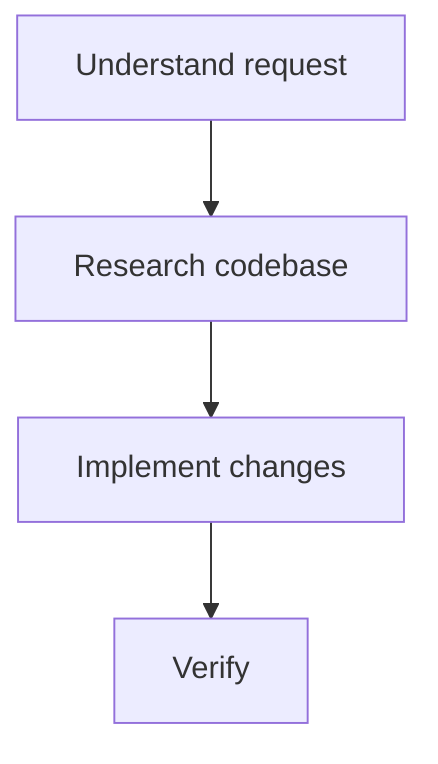

# CLAUDE.md

This file provides guidance to Claude Code (claude.ai/code) when working with code in this repository.

## Project Overview

**run-claude** is an agent shim controller that provides directory-aware model routing via a LiteLLM proxy. When you `cd` into a directory that declares a profile, the required models are added to a running LiteLLM proxy and environment variables are set so Claude Code (or other tools) route through it.

**Two-layer configuration:**
1. **Model Definitions** (`models.yaml`) — standalone LiteLLM model configs
2. **Profiles** (`profiles.yaml`) — lightweight references to model definitions mapping opus/sonnet/haiku tiers

For detailed architecture with data flow diagrams, see `docs/PROJ-ARCH.md`.
For full project layout, see `docs/PROJ-LAYOUT.md`.

## Build & Development Commands

```bash
# Install dev dependencies
make dev              # runs: uv sync --dev

# Install as a tool
make install          # runs: uv tool install .
make refresh          # force reinstall with cache refresh

# Run tests
make test             # runs: uv run pytest
make test-cov         # with coverage report
make coverage-html    # HTML report in htmlcov/

# Run a single test
uv run pytest tests/test_cli.py -k "test_name"

# Setup litellm venv with custom callbacks
make setup-litellm

# Cleanup
make clean
```

## Architecture

```
run_claude/
├── cli.py           # CLI entry point & command dispatcher (argparse subcommands)
├── config.py        # Secrets management, YAML parsing, .env generation
├── state.py         # JSON state persistence: tokens, refcounts, leases, janitor
├── proxy.py         # LiteLLM proxy lifecycle: start/stop, health, model API calls
├── profiles.py      # Profile/model loading & resolution from YAML
├── models.yaml      # Built-in model definitions (LiteLLM configs)
├── callbacks/
│   └── provider_compat.py  # Custom LiteLLM callback: strips unsupported fields
│                            # for strict providers (Groq, Cerebras, Together, Anyscale)
└── dep/
    └── docker-compose.yaml  # TimescaleDB infrastructure template
```

**Key flows:**
- Shell hook detects `AGENT_SHIM_TOKEN` change (set by direnv) → calls `run-claude enter/leave`
- `enter` registers models with LiteLLM proxy via API, tracks refcounts in state
- `leave` decrements refcounts; `janitor` cleans up unused models after 15 minutes
- Proxy runs on `http://localhost:4444` with generated config at `~/.local/state/run-claude/litellm_config.yaml`

**Design patterns:**
- **Refcount with lease** — models at refcount 0 get a 15-min lease before deletion (prevents thrashing)
- **Stable tokens** — directory paths hashed via SHA256 for reproducible tokens
- **Environment variable hydration** — `os.environ/VAR_NAME` syntax in YAML expanded at runtime
- **Multi-file fallthrough** — profile search order: user override → user → built-in; `model: null` disables and falls through

**XDG-compliant paths:**

| Type | Default Path |
|------|-------------|
| Config | `~/.config/run-claude/` (.secrets, .env, profiles, models) |
| State | `~/.local/state/run-claude/` (state.json, proxy.pid, proxy.log) |

**Network defaults:**
- LiteLLM proxy: `127.0.0.1:4444`
- TimescaleDB: port `5433` (mapped from container 5432)

## Key Dependencies

- Python >= 3.10, built with **hatchling**
- **uv** for package management (not pip)
- **litellm[proxy]** + litellm-proxy-extras — LLM proxy framework
- **httpx** — HTTP client for proxy API calls
- **prisma == 0.11.0** — database ORM (pinned version)
- **pyyaml** — config parsing
- **psycopg2-binary** — PostgreSQL driver for TimescaleDB

## Testing

- pytest with `-v` flag by default (configured in `pyproject.toml`)
- Tests in `tests/` directory: `test_cli.py`, `test_callbacks.py`
- Coverage configured for `run_claude/` source with branch coverage
- `playground/` contains manual test directories for different provider profiles

## Conventions

- Entry point: `run_claude.cli:main` (registered as `run-claude` console script)
- Lazy imports in `proxy.py` (`httpx`, `yaml`) with fallback to `None` for build-time safety
- `profiles.yaml` and `templates/` are force-included in the wheel via hatch config
- `callbacks/provider_compat.py` runs inside the LiteLLM proxy process (separate venv at `~/.local/share/litellm/.venv`), not the main run-claude process
- First-run initialization: `ensure_initialized()` checks `~/.config/run-claude/.initialized` marker, copies built-in profiles/models to user config if missing

---

## Tool Usage Rules

Use **specialized tools** instead of shell equivalents:
- `Read` not `cat`/`head`/`tail` — `Glob` not `find`/`ls` — `Grep` not `grep`/`rg` — `Edit` not `sed`/`awk`
- Always use **absolute paths**
- **Read before editing** — mandatory; never modify a file you haven't read first
- Run **independent tool calls in parallel** in a single message
- Use `EnterPlanMode` for non-trivial work (>3 files, architectural decisions, ambiguous requirements)
- Use `Task(subagent_type="Explore", ...)` for deep codebase research; `Glob`/`Grep` directly for targeted lookups
- **Context reduction:** When launching multiple similar agents, store shared setup in a temp scratchpad file and have each agent read it

### Available Agents (via Task tool)

| Agent | Use for |
|-------|---------|
| `Explore` | Fast codebase search/understanding |
| `Plan` | Design implementation approaches |
| `Bash` | Terminal-only tasks |
| `tdd-coder` | Autonomous implementation from PRD + tests |
| `tdd-tester` | Generate test suites from PRD |
| `tdd-debugger` | Diagnose test failures |
| `general-purpose` | Complex multi-step research |

---

## Response Protocol

Every response MUST follow this structure:

### 1. Assumptions Table

Open with a table listing every assumption made to resolve ambiguity:

| # | Assumption | Basis |
|---|------------|-------|
| 1 | e.g. "User wants Python 3.10+" | pyproject.toml config |

#### Planning Mode: Assumption Confirmation

When in **planning mode** (or before non-trivial work), do not simply list assumptions and proceed. Instead, **ask the user to confirm or select** the assumption that will guide the work:

1. **Present your recommended assumption first** — the one you've decided on based on context
2. **Ask for user confirmation/selection** — make this the primary question
3. **Provide alternative options** — list other assumptions considered but not selected

Example format:

```markdown
## Assumptions

I need to clarify an ambiguity before proceeding:

**Recommended assumption:**
> The API should follow RESTful conventions with JSON responses

[Select this as the recommended approach]

**Alternatives considered:**
- GraphQL-based API (rejected due to complexity)
- RPC-style endpoints (rejected due to lack of standardization)
```

This ensures user preferences are incorporated before committing to a direction. For straightforward tasks with low-risk assumptions, the standard table format above is sufficient.

### 2. Response Plan

Show a mermaid diagram of the planned approach:



### 3. Context & Restatement

State what role/context you're responding as. Restate the request. Show how context, knowledge, and assumptions shape the response.

### 4. Execute

Follow the plan.

### 5. Reflection (always last)

End **every** response with a self-review block:

```
<npl-block type="reflection">
[one issue per line, emoji-prefixed, < 80 chars each]
</npl-block>
```

**Emoji key:**

| Emoji | Meaning |
|-------|---------|
| ✅ | Verified correct |
| 🐛 | Bug/logical error |
| 🔒 | Security vulnerability |
| ⚠️ | Pitfall/gotcha |
| 🚀 | Improvement opportunity |
| 🧩 | Unhandled edge case |
| 📝 | TODO/incomplete |
| 🔄 | Refactor candidate |
| ❓ | Needs clarification |

**Rules:** Be specific (cite line numbers, function names). Be actionable (say what to fix). Always include at least one ✅. Never skip the block. One issue per line, < 80 chars.

---

## Skill Commands

The following custom skills remain available via `/command`:
- `/annotate` — Footnote annotations (copies to `{file}.annotated.{ext}.md`, never modifies originals)
- `/task-wizard` — Task CLI management guide
- `/update-arch-doc` — `docs/PROJ-ARCH.md` maintenance (< 300 lines, extract to `arch/`)
- `/update-layout-doc` — `docs/PROJ-LAYOUT.md` maintenance (< 150 lines, extract to `layout/`)
