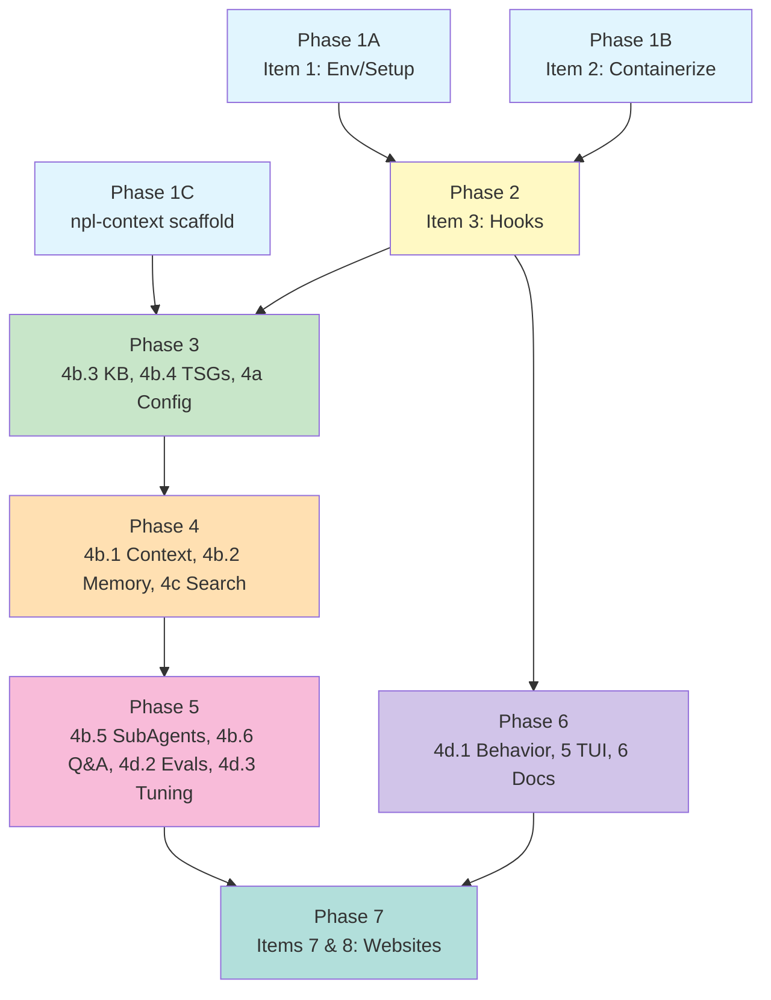

# PRD-00: Meta-Plan — Execution Sequence & Phase Overview

## Overview

This document defines the execution order, dependency graph, and parallelization strategy for the run-claude roadmap. Each item has a dedicated PRD (`PRD-01` through `PRD-08`).

## Repos

| Repo | Scope |
|------|-------|
| `run-claude` | Items 1, 2, 3, 4d.1, 5, 6 (core CLI, proxy, hooks, TUI, docs) |
| `npl-context` | Items 4a, 4b.1-6, 4c, 4d.2-3 (FastMCP MCP service) |
| `run-claude-website` | Item 7 (landing page, separate repo) |
| `npl-website` | Item 8 (landing page, separate repo) |

## Dependency Graph

## Phase Details

### Phase 1 — Foundation (fully parallel, no file overlap)

| Branch | Item | Touches | Est. |
|--------|------|---------|------|
| A | 1: Env/Setup | `config.py`, `cli.py` (secrets/install) | 2 days |
| B | 2: Containerize LiteLLM | `proxy.py`, `dep/`, docker files | 3 days |
| C | npl-context scaffold | New repo: pyproject.toml, server.py, migrations | 1 day |

**Merge gate**: All three branches pass tests, `run-claude proxy start` launches both containers.

### Phase 2 — Hook Infrastructure (depends on Phase 1)

| Branch | Item | Touches | Est. |
|--------|------|---------|------|
| D | 3: Lifecycle Hooks | `run_claude/hooks/`, `callbacks/provider_compat.py` | 2 days |

**Merge gate**: Pre-request and post-response hooks fire on proxy traffic. Built-in log hooks produce output.

### Phase 3 — Knowledge First (depends on Phase 2, items parallel)

| Branch | Item | Touches | Est. |
|--------|------|---------|------|
| E | 4b.3: Knowledge Base | `npl_context/tools/knowledge_base.py`, `.claude/knowledge-base/` | 2 days |
| F | 4b.4: TSGs | `npl_context/tools/tsg.py`, `.claude/tsgs/` | 2 days |
| G | 4a: Runtime Config | `npl_context/tools/model_config.py`, hooks | 2 days |

**Merge gate**: KB/TSG entries auto-detected in conversations. Runtime model overrides work via MCP tool.

### Phase 4 — Core MCP (depends on Phase 2, items parallel)

| Branch | Item | Touches | Est. |
|--------|------|---------|------|
| H | 4b.1: Context Ops | `npl_context/tools/context_ops.py`, hooks | 4 days |
| I | 4b.2: Memory | `npl_context/tools/memory.py`, hooks | 3 days |
| J | 4c: Search | `npl_context/tools/search.py`, `message_tracker.py` | 3 days |

**Merge gate**: Tag/revise/snip messages work. Memories inject with decay. Message history searchable.

### Phase 5 — Extended MCP (depends on Phase 4, items parallel)

| Branch | Item | Touches | Est. |
|--------|------|---------|------|
| K | 4b.5: Sub-Agents | `npl_context/tools/subagent.py` | 3 days |
| L | 4b.6: Q&A | `npl_context/tools/qna.py`, webhooks | 2 days |
| M | 4d.2: Evals | `npl_context/tools/eval.py`, NPL parser | 2 days |
| N | 4d.3: Tuning | `npl_context/tools/tuning.py` | 2 days |

**Merge gate**: Sub-agent tasks injectable. Q&A routes to Slack. Eval scores computed. JSONL export works.

### Phase 6 — Polish (can parallel with Phase 5)

| Branch | Item | Touches | Est. |
|--------|------|---------|------|
| O | 4d.1: Behavior | `profiles.py`, `state.py`, `behavior_router.py` | 2 days |
| P | 5: TUI | `run_claude/tui/` | 3 days |
| Q | 6: Docs | docstrings, Sphinx, man pages, ReadTheDocs | 3 days |

### Phase 7 — Marketing (after product stable)

| Branch | Item | Touches | Est. |
|--------|------|---------|------|
| R | 7: run-claude website | Separate repo (Astro + Vercel) | 5 days |
| S | 8: NPL website | Separate repo (Next.js + Vercel) | 5 days |

## Parallelization Strategy

Use **git worktrees** for branches with no file overlap within the same phase. Merge to `main` between phases via PR.

For `npl-context`, branches touch separate tool modules but share `storage/db.py`. Coordinate via:
1. Single migration file per phase (e.g., `002_phase3.sql`)
2. Each branch adds tables only, no ALTER on shared tables
3. Merge migration conflicts resolved by concatenation

## PRD Index

| PRD | Item | Phase |
|-----|------|-------|
| [PRD-01](PRD-01-ENV-SETUP.md) | Env Variables & Setup | 1A |
| [PRD-02](PRD-02-CONTAINERIZE.md) | Containerized LiteLLM | 1B |
| [PRD-03](PRD-03-HOOKS.md) | Lifecycle Hooks | 2 |
| [PRD-04A](PRD-04A-RUNTIME-CONFIG.md) | Runtime Config Tweaks | 3 |
| [PRD-04B1](PRD-04B1-CONTEXT-OPS.md) | Context Manipulation | 4 |
| [PRD-04B2](PRD-04B2-MEMORY.md) | Synthetic Memory | 4 |
| [PRD-04B3](PRD-04B3-KB.md) | Knowledge Base | 3 |
| [PRD-04B4](PRD-04B4-TSGS.md) | Troubleshooting Guides | 3 |
| [PRD-04B5](PRD-04B5-SUBAGENTS.md) | Sub-Agent Tasks | 5 |
| [PRD-04B6](PRD-04B6-QNA.md) | Q&A Forum | 5 |
| [PRD-04C](PRD-04C-SEARCH.md) | Extended Search | 4 |
| [PRD-04D1](PRD-04D1-BEHAVIOR.md) | Dynamic Behavior | 6 |
| [PRD-04D2](PRD-04D2-EVALS.md) | Task Evals | 5 |
| [PRD-04D3](PRD-04D3-TUNING.md) | Fine-Tuning Datasets | 5 |
| [PRD-05](PRD-05-TUI.md) | TUI & Terminal | 6 |
| [PRD-06](PRD-06-DOCS.md) | Documentation | 6 |
| [PRD-07](PRD-07-RC-WEBSITE.md) | run-claude Website | 7 |
| [PRD-08](PRD-08-NPL-WEBSITE.md) | NPL Website | 7 |
