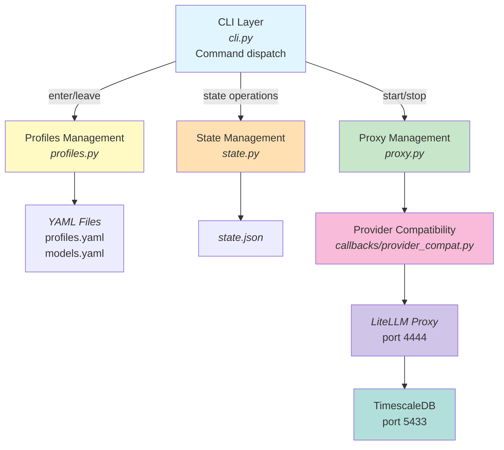
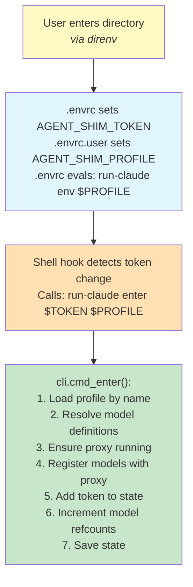
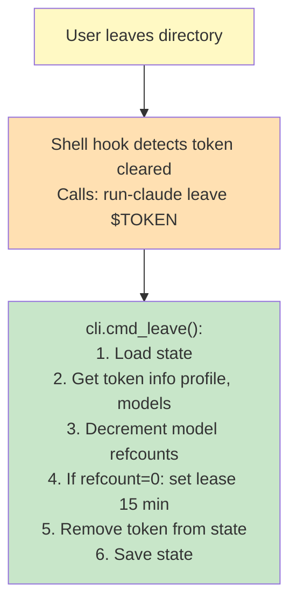
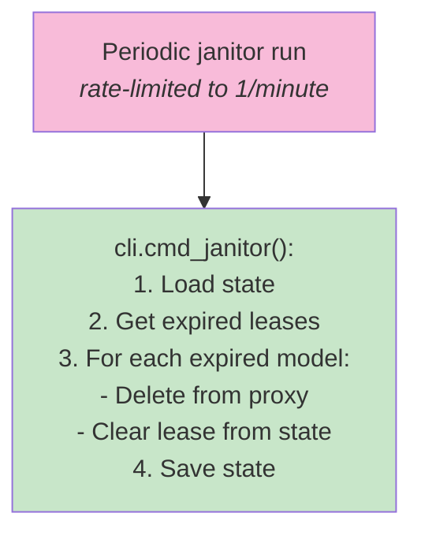
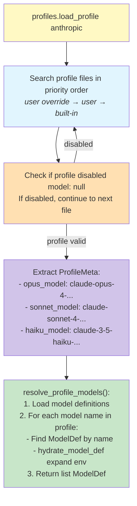
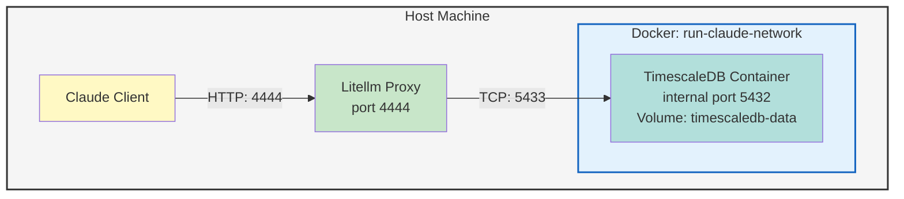

# Project Architecture

This document describes the architecture, data flow, and design patterns of the run-claude project.

## High-Level Architecture



## Core Components

### 1. CLI Layer (`cli.py`)

Entry point handling all user commands.

**Commands:**

| Command | Handler | Purpose |
|---------|---------|---------|
| `enter` | `cmd_enter()` | Register directory + profile + token |
| `leave` | `cmd_leave()` | Unregister directory token |
| `janitor` | `cmd_janitor()` | Clean up expired model leases |
| `set-folder` | `cmd_set_folder()` | Configure directory with .envrc |
| `status` | `cmd_status()` | Show proxy & state status |
| `env` | `cmd_env()` | Print environment for profile |
| `proxy` | `cmd_proxy()` | Proxy control (start/stop/status) |
| `profiles` | `cmd_profiles()` | Profile management |
| `models` | `cmd_models()` | Model definition management |
| `with` | `cmd_run()` | Run command with profile |
| `install` | `cmd_install()` | Install built-in assets |
| `secrets` | `cmd_secrets()` | Secrets management |

### 2. Profile System (`profiles.py`)

Multi-file configuration with fallthrough loading.

**Data Structures:**

```python
@dataclass
class ModelDef:
    model_name: str
    litellm_params: dict[str, Any]

@dataclass
class ProfileMeta:
    name: str
    opus_model: str      # Model name for Opus tier
    sonnet_model: str    # Model name for Sonnet tier
    haiku_model: str     # Model name for Haiku tier

@dataclass
class Profile:
    meta: ProfileMeta
    model_list: list[ModelDef]
    source_path: Path | None
```

**File Search Order (first match wins):**

1. `~/.config/run-claude/user.profiles.yaml` (highest priority)
2. `~/.config/run-claude/profiles.yaml`
3. `<package>/user.profiles.yaml`
4. `<package>/profiles.yaml` (lowest priority)

**Key Functions:**

- `load_profile(name)`: Load profile with fallthrough
- `resolve_profile_models()`: Convert model names to ModelDef objects
- `hydrate_model_def()`: Expand `os.environ/VAR` references
- `list_profiles()`: List available profiles

### 3. State Management (`state.py`)

Persistent state tracking using JSON.

**Data Structures:**

```python
@dataclass
class TokenInfo:
    profile: str
    last_seen: float  # Unix timestamp
    directory: str

@dataclass
class State:
    proxy_pid: int | None
    active_tokens: dict[str, TokenInfo]
    model_refcounts: dict[str, int]
    model_leases: dict[str, float]  # model -> delete_after epoch
    last_janitor_run: float
```

**Storage:** `~/.local/state/run-claude/state.json`

### 4. Proxy Management (`proxy.py`)

LiteLLM proxy lifecycle and model registration.

**Configuration:**

| Setting | Default |
|---------|---------|
| Host | `127.0.0.1` |
| Port | `4444` |
| Master Key | `sk-litellm-master-key-12345` |
| Database | `postgresql://localhost:5433/postgres` |

**Key Functions:**

- `start_proxy()`: Spawn proxy subprocess, wait for health
- `stop_proxy()`: Graceful shutdown with SIGTERM/SIGKILL
- `health_check()`: GET `/health` endpoint
- `add_model()`: POST `/model/new`
- `delete_model()`: POST `/model/delete`
- `ensure_models()`: Bulk add models (skip existing)

### 5. Secrets Management (`config.py`)

Secure credential storage and export.

**File Location:** `~/.config/run-claude/.secrets` (YAML, mode 0600)

**Required Secrets:**

- `RUN_CLAUDE_TIMESCALEDB_PASSWORD`
- `ANTHROPIC_API_KEY`

**Key Functions:**

- `load_secrets()`: Load YAML secrets file
- `create_secrets_template()`: Generate documented template
- `export_env_file()`: Convert to `.env` for Docker

### 6. Provider Compatibility Layer (`callbacks/provider_compat.py`)

Handles provider-specific quirks and normalization across different AI service providers.

**Purpose:**
- Abstract provider API differences
- Normalize model identifiers and parameters
- Handle provider-specific authentication patterns
- Provide compatibility adapters for legacy API behaviors

**Key Components:**
- Provider callbacks for authentication
- Model ID normalization functions
- Parameter validation and transformation

This layer bridges differences between providers like Anthropic, OpenAI, Groq, Cerebras, etc. ensuring consistent behavior through the LiteLLM proxy.

## Data Flows

### Directory Enter Flow



### Directory Leave Flow



### Janitor Cleanup Flow



### Profile Resolution Flow



## Design Patterns

### 1. Stable Token Generation

Directory paths are hashed to create stable, reproducible tokens:

```python
canonical = directory.resolve()
token = hashlib.sha256(str(canonical).encode()).hexdigest()[:16]
```

### 2. Refcount with Lease Pattern

Prevents model thrashing (rapid add/delete cycles):

```
Refcount > 0  →  Model is in-use, keep registered
Refcount = 0  →  Model enters lease period (15 min default)
Lease expired →  Janitor deletes from proxy
```

### 3. Environment Variable Hydration

Model definitions reference environment variables with special syntax:

```yaml
litellm_params:
  api_key: os.environ/ANTHROPIC_API_KEY
```

Expanded at runtime before registering with proxy.

### 4. Multi-File Configuration Fallback

Profiles and models use layered configuration:

- **User files** override built-in files
- **Disabled profiles** (`model: null`) fall through to next source
- Enables customization without modifying source

### 5. First-Run Initialization

```python
ensure_initialized()
  → Check ~/.initialized marker
  → If missing: copy built-in profiles/models to user config
  → Create XDG-compliant directories
```

### 6. Health Check with Recovery

```python
health_check(wait_for_recovery=True, max_retries=30)
  → Retry up to 30 times with 10s interval
  → Allows proxy to stabilize after model registration
```

## External Dependencies

| Package | Purpose |
|---------|---------|
| `pyyaml` | YAML parsing for profiles, models, secrets |
| `httpx` | HTTP client for proxy API calls |
| `psycopg2-binary` | PostgreSQL driver for database testing |
| `prisma` | ORM for LiteLLM proxy (referenced in env) |

## Environment Variables

### Proxy Configuration

| Variable | Default | Purpose |
|----------|---------|---------|
| `LITELLM_PROXY_URL` | `http://127.0.0.1:4444` | Proxy base URL |
| `LITELLM_MASTER_KEY` | `sk-litellm-master-key-12345` | Proxy API key |
| `LITELLM_DATABASE_URL` | See below | Database connection |
| `STORE_MODEL_IN_DB` | `True` | Enable DB model storage |
| `USE_PRISMA_MIGRATE` | `True` | Enable migrations |

### Client Environment (exported by `run-claude env`)

| Variable | Purpose |
|----------|---------|
| `ANTHROPIC_AUTH_TOKEN` | Proxy master key |
| `ANTHROPIC_BASE_URL` | Proxy URL |
| `ANTHROPIC_DEFAULT_OPUS_MODEL` | Profile's opus model |
| `ANTHROPIC_DEFAULT_SONNET_MODEL` | Profile's sonnet model |
| `ANTHROPIC_DEFAULT_HAIKU_MODEL` | Profile's haiku model |
| `API_TIMEOUT_MS` | API timeout (3000000ms) |

## Database Schema

TimescaleDB with extensions:

- **vector**: Vector embeddings for LLM context
- **pg_trgm**: Trigram search for text matching

LiteLLM uses Prisma ORM for:

- Model registry and parameters
- API key management
- Request/response logging

## Network Architecture



## Process Lifecycle

### Proxy Startup

1. Generate `litellm_config.yaml` with model definitions
2. Spawn `litellm --config <path>` subprocess
3. Wait for health check (30 retries × 10s)
4. Store PID in `~/.local/state/run-claude/proxy.pid`
5. Update state with `proxy_pid`

### Proxy Shutdown

1. Read PID from file
2. Send SIGTERM
3. Wait for graceful exit (timeout: 5s)
4. Send SIGKILL if needed
5. Clean up PID file
6. Update state

## Security Considerations

- Secrets file uses mode `0600` (owner only)
- API keys stored in `~/.config/run-claude/.secrets`
- Environment variables hydrated at runtime (not stored in configs)
- Proxy runs on localhost only (`127.0.0.1`)
- Database on non-standard port (`5433`) to avoid conflicts
