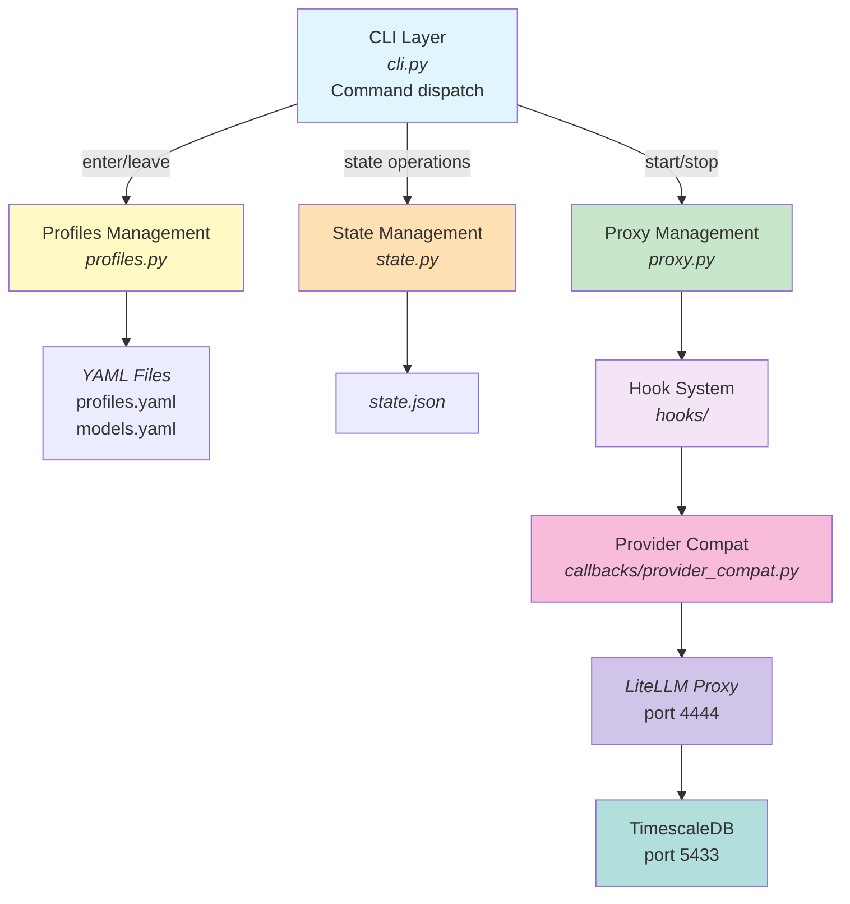

# Project Architecture

This document describes the architecture of run-claude, an agent shim controller that provides directory-aware model routing via a LiteLLM proxy.

## High-Level Architecture

```mermaid
graph TD
    CLI[CLI Layer<br/><i>cli.py</i><br/>Command dispatch] --> |enter/leave| PROFILES
    CLI --> |state operations| STATE
    CLI --> |start/stop| PROXY

    PROFILES[Profiles Management<br/><i>profiles.py</i>] --> YAML[<i>YAML Files</i><br/>profiles.yaml<br/>models.yaml]
    STATE[State Management<br/><i>state.py</i>] --> STATEFILE[<i>state.json</i>]
    PROXY[Proxy Management<br/><i>proxy.py</i>] --> HOOKS[Hook System<br/><i>hooks/</i>]
    HOOKS --> COMPAT[Provider Compat<br/><i>callbacks/provider_compat.py</i>]

    COMPAT --> LITELLM[<i>LiteLLM Proxy</i><br/>port 4444]
    LITELLM --> DB[TimescaleDB<br/>port 5433]

    style CLI fill:#e1f5fe
    style PROFILES fill:#fff9c4
    style STATE fill:#ffe0b2
    style PROXY fill:#c8e6c9
    style HOOKS fill:#f3e5f5
    style COMPAT fill:#f8bbd9
    style LITELLM fill:#d1c4e9
    style DB fill:#b2dfdb
```

## Core Components

| Component | Source | Purpose |
|-----------|--------|---------|
| CLI Layer | `cli.py` | Entry point, command dispatch via argparse |
| Profile System | `profiles.py` | Multi-file profile/model loading with fallthrough |
| State Management | `state.py` | JSON persistence: tokens, refcounts, leases |
| Proxy Management | `proxy.py` | LiteLLM proxy lifecycle and model registration |
| Secrets | `config.py` | Credential storage, `.env` generation |
| Hook System | `hooks/` | Extensible lifecycle hooks for request/response interception |
| Provider Compat | `callbacks/provider_compat.py` | Strips unsupported fields for strict providers |

### CLI Commands

| Command | Purpose |
|---------|---------|
| `enter` | Register directory + profile + token |
| `leave` | Unregister directory token |
| `janitor` | Clean up expired model leases |
| `set-folder` | Configure directory with .envrc |
| `status` | Show proxy & state status |
| `env` | Print environment for profile |
| `proxy` | Proxy control (start/stop/status/health/db-test) |
| `db` | Database container management (start/stop/status/migrate) |
| `profiles` | Profile management (list/show/install) |
| `models` | Model definition management (list/show/wipe) |
| `with` | Run command with profile environment |
| `install` | Install built-in assets |
| `secrets` | Secrets management (init/path/export) |
| `setup` | Interactive setup wizard for API keys |

### Profile System

Multi-file configuration with fallthrough. File search order (first match wins):

1. `~/.config/run-claude/user.profiles.yaml` (highest priority)
2. `~/.config/run-claude/profiles.yaml`
3. `<package>/user.profiles.yaml`
4. `<package>/profiles.yaml` (lowest priority)

Key data structures: `ModelDef` (model name + litellm params), `ProfileMeta` (name + opus/sonnet/haiku model refs), `Profile` (meta + resolved model list).

### State Management

Persistent JSON state at `~/.local/state/run-claude/state.json` tracking: proxy PID, active tokens (profile + directory + last seen), model refcounts, model leases (delete-after epoch), and last janitor run timestamp.

### Hook System

Extensible lifecycle hooks in `hooks/` for request/response interception. Hooks execute sequentially via `HookChain` with error isolation — one hook failure doesn't break the chain.

**Events:** `PRE_REQUEST`, `POST_RESPONSE`, `PRE_TOOL_CALL`, `POST_TOOL_CALL`

**Components:**
- `hooks/__init__.py` — `HookEvent` enum, `HookContext` dataclass, `HookFn` type alias
- `hooks/chain.py` — `HookChain` executor with register/execute/list, module-level singleton
- `hooks/loader.py` — YAML-based hook config loader with dynamic module import
- `hooks/builtin.py` — Built-in hooks: `log_request`, `log_response`, `strip_provider_fields`

### Provider Compatibility

`callbacks/provider_compat.py` runs inside the LiteLLM proxy process (separate venv). Strips `provider_specific_fields` and `cache_control` for strict providers (Groq, Cerebras, Together, Anyscale). The `hooks/builtin.py` module provides the same logic as a hook-chain alternative.

## Data Flows

Requests enter via direnv shell hooks that detect `AGENT_SHIM_TOKEN` changes, triggering `enter`/`leave` commands. The janitor periodically cleans up expired model leases.

-> *See [arch/data-flows.md](arch/data-flows.md) for detailed flow diagrams*

## Design Patterns

Key patterns: stable token generation (SHA256 hash of directory path), refcount with lease (15-min grace period prevents thrashing), environment variable hydration (`os.environ/VAR` syntax), multi-file config fallback, first-run initialization, health check with recovery, hook chain with error isolation.

-> *See [arch/design-patterns.md](arch/design-patterns.md) for details*

## Infrastructure

Proxy runs on `127.0.0.1:4444`, TimescaleDB in Docker on port `5433`. XDG-compliant paths: config in `~/.config/run-claude/`, state in `~/.local/state/run-claude/`.

-> *See [arch/infrastructure.md](arch/infrastructure.md) for network diagram, environment variables, and security details*

## External Dependencies

| Package | Purpose |
|---------|---------|
| `pyyaml` | YAML parsing for profiles, models, secrets, hooks |
| `httpx` | HTTP client for proxy API calls |
| `psycopg2-binary` | PostgreSQL driver for database |
| `prisma` | ORM for LiteLLM proxy |
