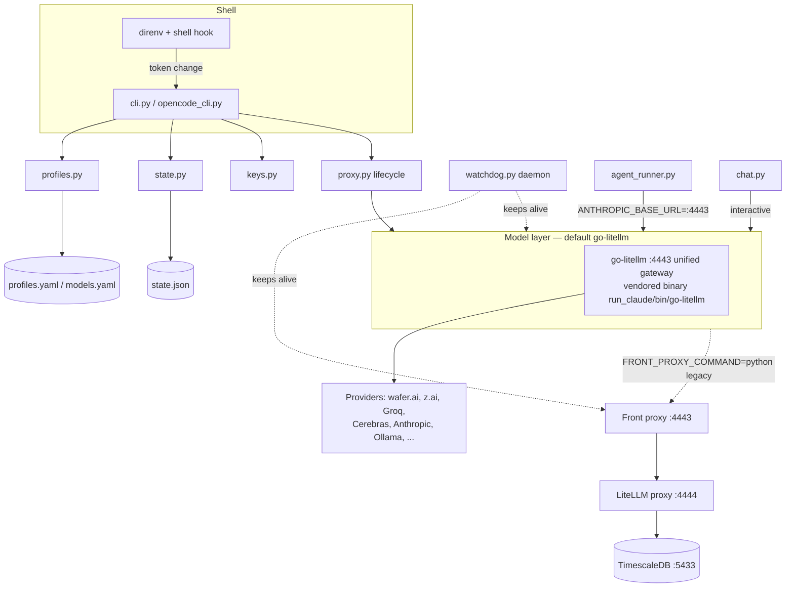

# Project Architecture

run-claude provides directory-aware model routing for Claude Code and OpenCode via a self-healing local LLM gateway. When you `cd` into a directory declaring a profile, the required models are registered with a running gateway and environment variables are set so Claude Code (or OpenCode, via the shared agent runner) route through it. The system uses a two-layer configuration: **model definitions** (standalone LiteLLM-style configs in `run_claude/models.yaml`) and **profiles** (lightweight references mapping opus/sonnet/haiku/fable tiers to model definitions in the root `profiles.yaml`).

Runtime traffic flows through a **unified Go gateway by default**: `go-litellm` (a single static binary) replaces the older two-process Python chain. `FRONT_PROXY_COMMAND` can override it (e.g. `ex-litellm`) or set the sentinel `python`/`legacy` to fall back to the original front proxy (`:4443`) → LiteLLM (`:4444`) chain. A detached **watchdog** daemon keeps the gateway process(es) alive either way.

## High-Level Architecture

```mermaid
graph TB
    subgraph Shell
        H[direnv + shell hook] -->|token change| CLI
    end
    CLI[cli.py / opencode_cli.py] --> P[profiles.py]
    CLI --> S[state.py]
    CLI --> K[keys.py]
    CLI --> PX[proxy.py lifecycle]
    P --> Y[(profiles.yaml / models.yaml)]
    S --> J[(state.json)]
    PX --> GW
    subgraph GW[Model layer — default go-litellm]
        GO[go-litellm :4443 unified gateway<br/>vendored binary run_claude/bin/go-litellm]
    end
    GO --> PR[Providers: wafer.ai, z.ai, Groq,<br/>Cerebras, Anthropic, Ollama, ...]
    GW -.FRONT_PROXY_COMMAND=python legacy.-> FP[Front proxy :4443] --> LL[LiteLLM proxy :4444]
    LL --> DB[(TimescaleDB :5433)]
    W[watchdog.py daemon] -.keeps alive.-> GW
    W -.keeps alive.-> FP
    AR[agent_runner.py] -->|ANTHROPIC_BASE_URL=:4443| GW
    CH[chat.py] -->|interactive| GW
```

## Core Components

| Component | File | Purpose |
|-----------|------|---------|
| CLI | `cli.py` | Command dispatch: enter/leave/janitor/set-folder/status/env/proxy/db/profiles/models/keys/chat/with/install/secrets |
| OpenCode CLI | `opencode_cli.py` | `run-open-code` entry point; re-exports shared command handlers for OpenCode |
| Agent runner | `agent_runner.py` | Shared launch logic for Claude/OpenCode: builds env (ANTHROPIC_BASE_URL → :4443, tier model vars), runs agent |
| Chat client | `chat.py` | Interactive terminal chat against the local gateway; model picker, `/keys` key switching |
| Profiles | `profiles.py` | Multi-file YAML loading with fallthrough; tier-to-model mapping |
| State | `state.py` | JSON persistence: tokens, refcounts, leases, key swaps, PIDs, stop marker |
| Proxy lifecycle | `proxy.py` | Gateway start/stop + health checks; resolves the model layer (go-litellm default, legacy Python chain via sentinel) |
| Key switching | `keys.py` | Named provider keys (`<FAMILY>_SUB_KEY[_SUFFIX]` env vars) swapped at runtime against go-litellm without changing model ids |
| Front proxy (legacy) | `front_proxy.py` | Always-on reverse proxy `:4443 → :4444`; auth swapping; OAuth passthrough mode |
| Watchdog | `watchdog.py` | Detached self-healing daemon; restarts gateway process(es) unless intentionally stopped |
| LiteLLM launcher | `litellm_proxy.py` | `run-litellm-proxy` entry: prisma schema patching, then execs litellm (legacy chain) |
| Secrets/config | `config.py` | `.secrets` (mode 0600), `.env` generation, `os.environ/VAR` hydration |
| Hooks | `hooks/` | Lifecycle hook chain (PRE_REQUEST, POST_RESPONSE, PRE/POST_TOOL_CALL) with error isolation |
| Provider compat | `callbacks/provider_compat.py` | LiteLLM callback stripping unsupported fields for strict providers; runs inside the legacy proxy process |
| Vendored gateway | `bin/go-litellm` | Compiled go-litellm binary bundled with the package |

## Unified Go Gateway (default model layer)

`go-litellm` (source: `repos/go-litellm` git submodule) serves both the agent-facing endpoint and provider routing in one process, so the default install needs no Python proxy runtime. It implements the Anthropic translate/stream contract, per-provider adapters (wafer.ai, z.ai, Groq, Anthropic, generic OpenAI-compatible), and a runtime named-key registry that `run-claude keys switch` re-points live. `ex-litellm` (Elixir port, `repos/ex-litellm`) is an alternative `FRONT_PROXY_COMMAND` target with the same role and its own request-log SQL table.

## Front Proxy & Passthrough Mode (legacy chain)

In the legacy chain, the front proxy (`:4443`) is the stable endpoint agents point at. In **standard mode** everything forwards to LiteLLM with the master key. In **passthrough mode** (claude-plan profile) Anthropic models forward to `api.anthropic.com` with the caller's original OAuth auth — preserving Claude subscription-plan usage — while non-Anthropic models swap auth to the LiteLLM master key. Non-2xx upstream responses are logged to a dedicated error log. It also exposes `GET /api/claude_cli/bootstrap` (model options for the Claude CLI from LiteLLM `/model/info` + models.yaml metadata) and persists swapped auth headers in `front-proxy-auth-state.json`; per-request logs land in `request-log.jsonl` (override via `RUN_CLAUDE_REQUEST_LOG`). Data shapes: see [PROJ-SCHEMA.md](PROJ-SCHEMA.md).

## Self-Healing Watchdog

`watchdog.py` runs as a detached (setsid) daemon polling the gateway process(es) every ~5s and restarting whichever is down or unhealthy. Intentional stops write a `stop.marker` sentinel in the state dir so the watchdog does not undo `run-claude proxy stop`; crashes and internal recovery stops never write it. The watchdog itself is respawned idempotently by `proxy start` and the shell-hook `enter` path.

## Data Flows

The primary flows are **directory enter** (direnv triggers → load profile → ensure gateway + watchdog → register models → set env vars), **directory leave** (decrement refcounts → set leases for cleanup), **janitor cleanup** (expire leases → delete unused models), **key switching** (`keys switch` → update named-key bindings → re-apply after restarts), and **profile resolution** (multi-file fallthrough with env hydration).

→ *See [arch/data-flows.md](arch/data-flows.md) for mermaid flow diagrams*

## Design Patterns

Key patterns: stable token generation (SHA256 hash of directory path), refcount with 15-min lease (prevents model thrashing), `os.environ/VAR` hydration, multi-file config fallback with `model: null` disable, named-key indirection (env var → canonical name → family/model binding), first-run initialization marker, stop-marker sentinel distinguishing intentional stops from crashes, health check with recovery, and hook chain with error isolation.

→ *See [arch/design-patterns.md](arch/design-patterns.md) for details and code examples*

## Infrastructure

The agent-facing endpoint stays `127.0.0.1:4443` in both modes. Default resolution for the go-litellm binary: vendored `run_claude/bin/go-litellm` → `PATH` → `~/.local/bin` → `repos/go-litellm/bin` (source-tree build). Legacy chain: front proxy `:4443` + LiteLLM `:4444` backed by TimescaleDB (Docker, port `5433`; Prisma pinned 0.11.0; extensions `vector`, `pg_trgm`). XDG paths: config at `~/.config/run-claude/`, state at `~/.local/state/run-claude/` (state.json, PID files, logs, generated `litellm_config.yaml`).

→ *See [arch/infrastructure.md](arch/infrastructure.md) for network diagram, env vars, process lifecycle, and security details*

## Ecosystem Fit (Noizu monorepo)

run-claude lives at `Portfolio/Utilities/source/run-claude` in the Noizu Infra monorepo (with a dual install path under `utilities/`) but is deliberately **not** part of the shell-utility toolchain: it does not source `share/k8-lib`, is not installed by `make install-utilities`, and has no `.infra-config.yaml` build target. It is a self-contained Python package (hatchling + uv) installed via its own `make install` (`uv tool install .`), exposing `run-claude`, `run-open-code`, and `run-litellm-proxy` console scripts. Its role in the ecosystem is developer-workstation model routing for the agent fleets that operate on this repo — profiles for wafer.ai, z.ai, Groq, Cerebras, Ollama-local, and mixed-provider setups let Claude Code / OpenCode sessions run against alternate providers per directory. Companion artifacts: an Elixir Hologram landing site (`web/`) deployed via the `helm/run-claude-landing` chart.

## Key Decisions

- **Unified Go gateway as default**: one static binary replaces the two-process Python chain — no proxy venv, no Prisma, faster startup; the Python chain remains available via the `python`/`legacy` sentinel for compatibility.
- **Named-key swapping over config rewrites**: provider keys are referenced by env-var-derived names (`<FAMILY>_SUB_KEY[_SUFFIX]`) so switching keys is a live registry update, not a model-catalog regeneration.
- **Two-proxy chain (legacy)**: front proxy gives a stable agent-facing endpoint and an auth/transform layer independent of LiteLLM restarts; enables OAuth passthrough for Anthropic subscription plans.
- **Watchdog over supervisor/systemd**: zero external service manager dependency; idempotent respawn from normal CLI paths keeps it self-healing.
- **Refcount + lease over immediate teardown**: rapid `cd` between projects would otherwise thrash model registration.
- **uv tool install over install-utilities**: Python package with a lockfile and venv needs real packaging, not the k8-lib symlink flow used by shell utilities.

## External Dependencies

| Package | Purpose |
|---------|---------|
| `httpx` | HTTP client for gateway API calls |
| `pyyaml` | YAML parsing for profiles, models, secrets |
| `litellm[proxy]` + `prisma == 0.11.0` + `psycopg2-binary` | Legacy Python chain only (proxy framework, ORM, TimescaleDB driver) |
