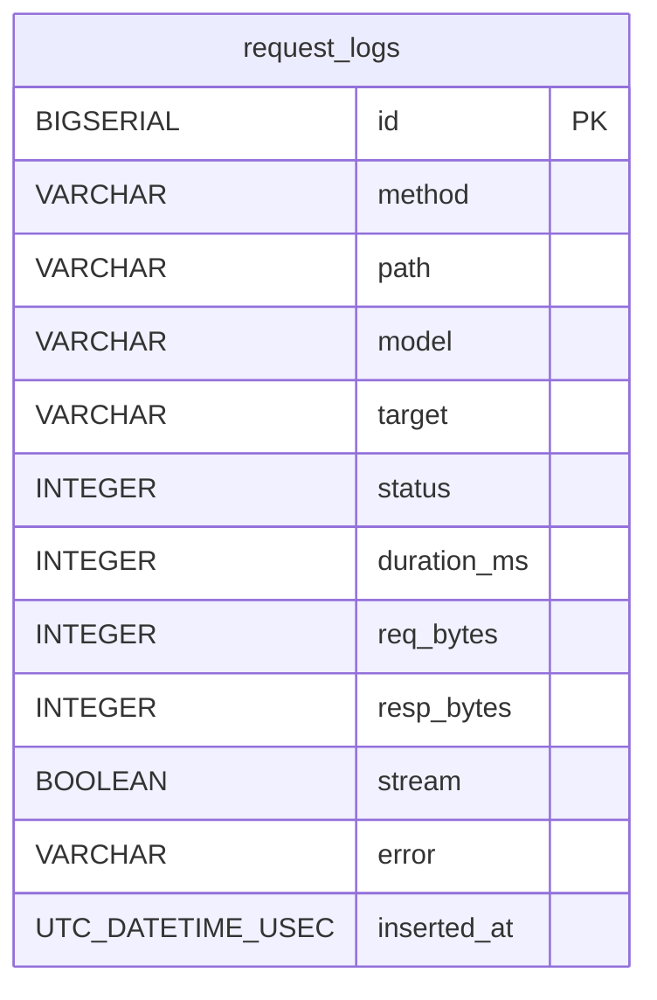

# Project Schema

run-claude's core is a **CLI + local proxy** with **no primary SQL persistence layer**.
State lives in JSON/config files under XDG paths. The single SQL table in the tree
belongs to the `repos/ex-litellm` Elixir gateway (submodule-style vendored repo).

| Layer | Store | Location |
|-------|-------|----------|
| Gateway request logs (SQL) | TimescaleDB/Postgres, Ecto | `repos/ex-litellm` → `request_logs` |
| Runtime state | JSON file | `~/.local/state/run-claude/state.json` |
| Profiles / models / hooks | YAML | repo + `~/.config/run-claude/` |
| Generated proxy config | YAML | `~/.local/state/run-claude/litellm_config.yaml` |
| Secrets / env | dotenv-style files | `~/.config/run-claude/.secrets`, `.env` |
| Per-project activation | direnv files | `<project>/.envrc`, `.envrc.user` |

## SQL: ex-litellm `request_logs`

Written asynchronously after every proxied/served gateway call; browsable at
`/status/requests`. Migration: `repos/ex-litellm/priv/repo/migrations/20260722120000_create_request_logs.exs`.
Note: uses Ecto's `inserted_at` convention (no `updated_at` column).



```plantuml
@startuml
skinparam linetype ortho

TABLE(request_logs) {
  * id : BIGSERIAL <<PK>>
  --
  method : VARCHAR
  path : VARCHAR
  model : VARCHAR
  target : VARCHAR
  status : INTEGER
  duration_ms : INTEGER
  req_bytes : INTEGER
  resp_bytes : INTEGER
  stream : BOOLEAN
  error : VARCHAR
  inserted_at : UTC_DATETIME_USEC
}
@enduml
```

**Indexes**: `request_logs_inserted_at_index` (inserted_at) — time-range queries;
`request_logs_status_index` (status) — error filtering. Single table, no FKs.

`dep/docker-compose.yaml` provisions the TimescaleDB container (host port 5433);
the core Python proxy never owns a migration against it.

## Config Artifacts (YAML)

### profiles.yaml (root; built-in fallback `run_claude/defaults/profiles.yaml`)

Profile → tier model mapping. Search order (first match wins):
`~/.config/run-claude/user.profiles.yaml` → `~/.config/run-claude/profiles.yaml` →
`<install>/user.profiles.yaml` → `<install>/profiles.yaml`. `model: null` disables
a profile at that priority and falls through.

| Field | Type | Description |
|-------|------|-------------|
| `<profile>` (key) | string | Profile name (e.g. `anthropic`, `groq-pro`) |
| `name` | string | Display name |
| `opus_model` / `sonnet_model` / `haiku_model` / `fable_model` | string | LiteLLM model_name per Claude tier |
| `extended` | list[string] | Extra model names registered with the proxy (incl. `[1m]` aliases) |

### models.yaml (`run_claude/models.yaml`; override `~/.config/run-claude/models.yaml`)

LiteLLM `model_list` entries:

| Field | Type | Description |
|-------|------|-------------|
| `model_name` | string | Unique routing name |
| `litellm_params.model` | string | `<provider>/<model>` spec |
| `litellm_params.api_key` | string | `os.environ/VAR_NAME` — expanded at runtime |
| `litellm_params.api_key_name` | string | Named-key binding (go-litellm key swap) |
| `litellm_params.api_base` | string | Optional custom endpoint |
| `metadata.provider/description/strengths/weaknesses` | string | Catalog annotations |

### hooks.yaml (`run_claude/defaults/hooks.yaml`; user override supported)

| Field | Type | Description |
|-------|------|-------------|
| `hooks.<event>` | list | Events: `pre_request`, `post_response`, (pre/post tool call) |
| `[].name` | string | Hook instance name |
| `[].module` / `[].function` | string | Python module + callable, dynamically imported |
| `[].enabled` | bool | Default `true`; errors are logged, never fatal |
| `[].config` | map | Free-form hook parameters |

### go-litellm gateway config (`repos/go-litellm/config.example.stage.yaml`; canonical in helm values)

Same `model_list` / `litellm_params` shape as models.yaml plus
`general_settings.master_key` — all secret refs use `os.environ/NAME`, resolved
at load time (`ResolveDeep`); no key values are ever stored in the file.

## State & Generated Files

### state.json (`~/.local/state/run-claude/state.json`, JSON)

Written by `run_claude/state.py`; fields per `State.to_dict()`:

| Field | Type | Description |
|-------|------|-------------|
| `proxy_pid` | int/null | LiteLLM proxy process |
| `active_tokens` | map[token → {profile, last_seen, dir}] | Per-directory activations (SHA256 path tokens) |
| `model_refcounts` | map[model → int] | How many dirs registered each model |
| `model_leases` | map[model → epoch float] | Delete-after time for refcount-0 models (900s default) |
| `last_janitor_run` | epoch float | Last lease-sweep timestamp |
| `key_families` | map[family → named key] | Active key swap per family (e.g. `zai → tyna`) |
| `key_bindings` | map[model_name → named key] | Per-model key override |
| `named_key_envs` | map[name → env var] | Extra named keys backed by env vars |

### litellm_config.yaml (`~/.local/state/run-claude/litellm_config.yaml`)

Generated LiteLLM proxy config; merges active `model_list` entries + hook
registration. Regenerated on profile change — treat as build output.

### Secrets structure (values never documented)

- `~/.config/run-claude/.secrets` — user-created `KEY=value` lines (provider API keys, e.g. `ANTHROPIC_API_KEY`, `ZAI_SUB_KEY[_SUFFIX]`)
- `~/.config/run-claude/.env` — auto-generated by `run-claude secrets export` from `.secrets`
- Named-key convention: `<FAMILY>_SUB_KEY` → canonical name `<family>`, `<FAMILY>_SUB_KEY_<SUFFIX>` → `<suffix>` (`run_claude/keys.py`)

### Per-project activation (generated by `run-claude set-folder`)

- `<project>/.envrc` — from `templates/envrc.tmpl`: exports `AGENT_SHIM_TOKEN` (SHA256 of path), sources `.envrc.user`, evals `run-claude env <profile>`
- `<project>/.envrc.user` — user-editable; sets `AGENT_SHIM_PROFILE`; gitignored
