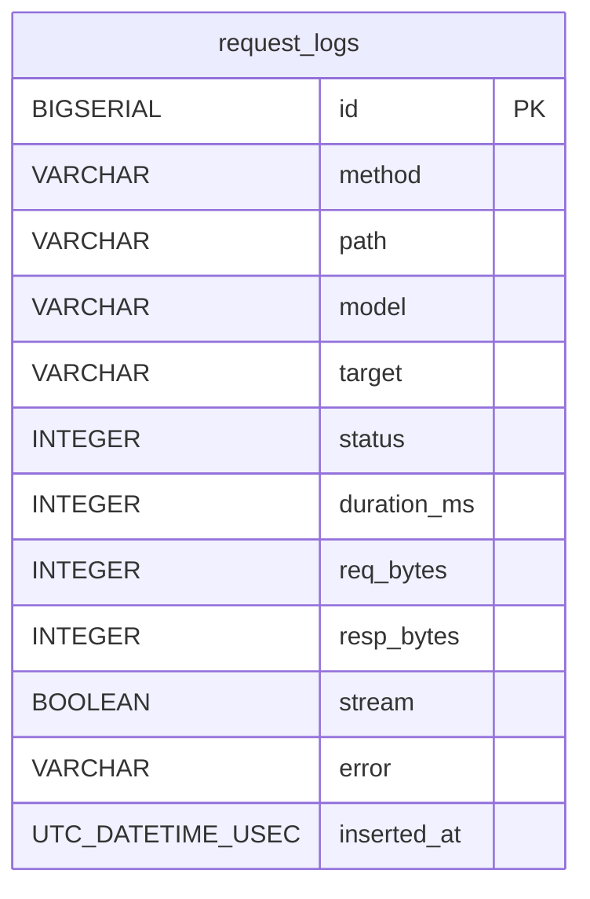

# Project Schema Summary

**No primary SQL persistence** — core is config/state files. Single SQL table in
`repos/ex-litellm` (Elixir gateway). Structure-only reference; secrets never valued here.

## Stores

| Store | Format | Location | Owner |
|-------|--------|----------|-------|
| `request_logs` | SQL (Ecto/TimescaleDB) | ex-litellm DB | `RequestLog` |
| Runtime state | JSON | `~/.local/state/run-claude/state.json` | `state.py` |
| Profiles | YAML | repo + `~/.config/run-claude/` (4-level fallthrough) | `profiles.py` |
| Models | YAML | `run_claude/models.yaml` + user override | `profiles.py` |
| Hooks | YAML | `run_claude/defaults/hooks.yaml` + user override | `hooks/loader.py` |
| Gateway config | YAML | go-litellm config (helm canonical) | go-litellm `internal/config` |
| Generated proxy cfg | YAML | `~/.local/state/run-claude/litellm_config.yaml` | `proxy.py` |
| Secrets / env | KEY=value files | `~/.config/run-claude/.secrets` → `.env` | `config.py` |
| Activation | direnv | `<project>/.envrc`, `.envrc.user` | `cli.py set-folder` |

## request_logs (single table)

`id` BIGSERIAL PK · method, path, model, target, error VARCHAR · status,
duration_ms, req_bytes, resp_bytes INTEGER · stream BOOLEAN ·
inserted_at UTC_DATETIME_USEC. Indexes: inserted_at, status. No FKs.

## state.json top-level keys

`proxy_pid` · `active_tokens{token: profile,last_seen,dir}` ·
`model_refcounts{model:int}` · `model_leases{model:epoch}` · `last_janitor_run` ·
`key_families{family:key}` · `key_bindings{model:key}` · `named_key_envs{name:env}`

## Front proxy (run_claude/front_proxy.py)

| File/Route | Shape |
|------------|-------|
| `front-proxy-auth-state.json` | `{headers: {…}}` persisted auth headers |
| `request-log.jsonl` | JSONL, one object per request (env: `RUN_CLAUDE_REQUEST_LOG`) |
| `GET /api/claude_cli/bootstrap` | `additional_model_options` = LiteLLM `/model/info` + models.yaml metadata |
| `/v1/messages` | Anthropic passthrough w/ model filtering + auth swap |
| `/v1/chat/completions` etc. | OpenAI passthrough → LiteLLM :4444 |

## Secret-ref conventions

All configs reference keys by `os.environ/VAR_NAME` — no values in YAML.
Named keys: `<FAMILY>_SUB_KEY[_SUFFIX]` → canonical `<family>`/`<suffix>`.
