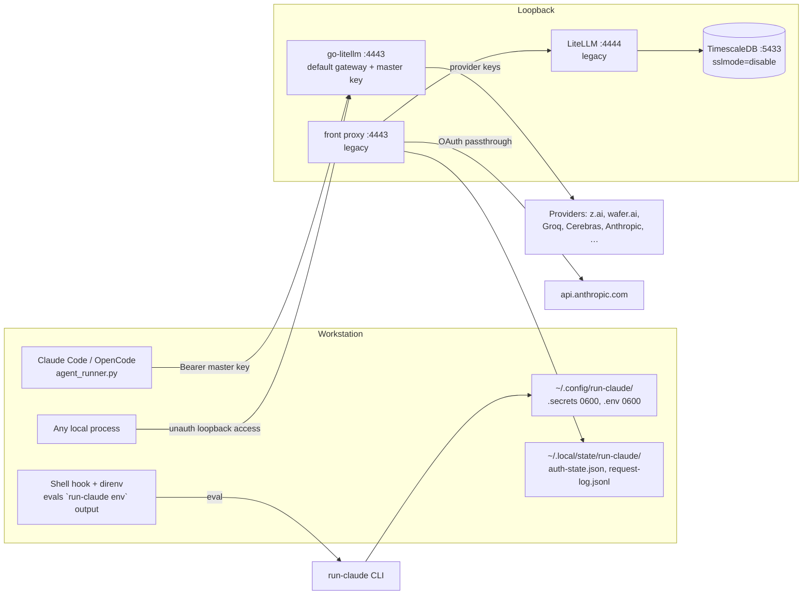

# Threat Model

run-claude is a **developer-workstation tool**: a local model gateway (`:4443`, loopback
only) that holds provider API keys and OAuth tokens, plus generated direnv/shell-hook
integration that evals CLI output. The crown jewels are (1) provider credentials in
`~/.config/run-claude/.secrets` / `.env`, (2) persisted upstream auth headers in
`front-proxy-auth-state.json`, and (3) the integrity of the shell environment the hooks
eval into. There is no public ingress for the core tool; the only deployed component is
the static landing site (`web/` + `helm/run-claude-landing`). Trust boundaries: local
processes ↔ loopback gateway, user config ↔ tool, and workstation ↔ provider APIs.

Grounding: components and flows per [PROJ-ARCH.md](PROJ-ARCH.md); file locations per
[PROJ-LAYOUT.md](PROJ-LAYOUT.md). Every mitigation below was verified against code.

## Attack Surface

## Vulnerability Register

| ID | Severity | STRIDE | Component | Status |
|----|----------|--------|-----------|--------|
| T-001 | Medium | Spoofing / EoP | `proxy.py:79` hardcoded fallback master key `sk-litellm-master-key-12345` when no `LITELLM_MASTER_KEY` in env/secrets — any local process knowing the public default can drive the gateway API (model registration, key registry) | Open — set `LITELLM_MASTER_KEY` in `.secrets` to mitigate |
| T-002 | Medium | Info disclosure | `front-proxy-auth-state.json` persists upstream OAuth/auth headers in plaintext; atomic write but **no chmod 0600** (unlike `.secrets`/`.env`) | Open |
| T-003 | Low | Info disclosure | `request-log.jsonl` records method/path/query/model + header report per request; error log may include response bodies; default dir `/var/log/run-cluade` (sic) may be world-readable | Partial — override via `RUN_CLAUDE_REQUEST_LOG`; no prompt bodies in the success path |
| T-004 | Low | Tampering / EoP | `templates/envrc.tmpl` evals `run-claude env "$AGENT_SHIM_PROFILE"` output; a hostile profile name in `.envrc.user` or injected CLI output executes arbitrary shell | Mitigated by trust model — `.envrc.user` is user-owned + gitignored; accepted (local trust) |
| T-005 | Low | EoP | `hooks/loader.py:82` dynamically imports arbitrary Python modules named in `hooks.yaml` (incl. user override) | Mitigated by trust model — hook config is local user config; equivalent to editing any dotfile |
| T-006 | Low | Spoofing | TimescaleDB connection uses `sslmode=disable` over localhost with env-var password | Accepted — loopback-only Docker container, legacy chain |
| T-007 | Low | DoS | Loopback gateway has no rate limiting; a misbehaving local process can exhaust provider quota/keys | Accepted — single-user workstation |
| T-008 | Medium | Info disclosure | Provider API keys transited via process env (`inject_secrets_into_env`) — visible to same-user process inspection (`ps`/`procfs` on Linux) | Partial — inherent to env-var hydration; secrets files themselves are 0600 |
| T-009 | Low | Tampering | Vendored prebuilt binary `run_claude/bin/go-litellm` ships in the wheel (supply chain: binary ≠ source at `repos/go-litellm`) | Partial — pinned submodule source; no hash verification of binary vs source build |
| T-010 | Info | Repudiation | No audit trail for key switches / model registration beyond `state.json` (no timestamps per change) | Accepted — single-user tool |

## Mitigation Coverage

2 mitigated/accepted-by-design · 3 partial · 2 open (T-001, T-002) · 3 accepted.

- **Secrets at rest**: `.secrets` and generated `.env` both `chmod 0600` (`config.py:267,324`); secrets never appear in YAML configs — all refs are `os.environ/VAR` resolved at load time.
- **Network**: all listeners bind `127.0.0.1` only (`proxy.py:76`, `front_proxy.py:507`); no remote ingress for the core tool.
- **Auth-state writes**: atomic (tmp + replace) preventing torn reads (`front_proxy.py:_write_json_file`) — but see T-002 for perms.
- **OAuth passthrough**: caller's original Anthropic auth is forwarded untouched; the tool never persists subscription credentials into configs (only into T-002's state file).

## Residual Risk

Single-user workstation tool: local-process trust is the baseline assumption — anything
running as the same user is already game over (T-004/T-005 are scoped to that boundary).
The two open items worth fixing: generate-and-persist a random master key instead of the
public default fallback (T-001), and `chmod 0600` on `front-proxy-auth-state.json`
(T-002). The deployed footprint (static landing site) holds no secrets and is out of
scope here; its perimeter is owned by the monorepo chart/ingress.
