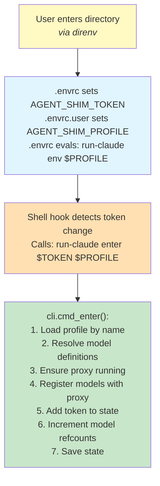
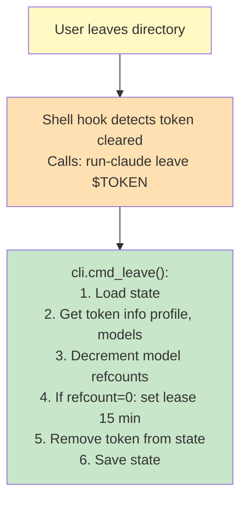
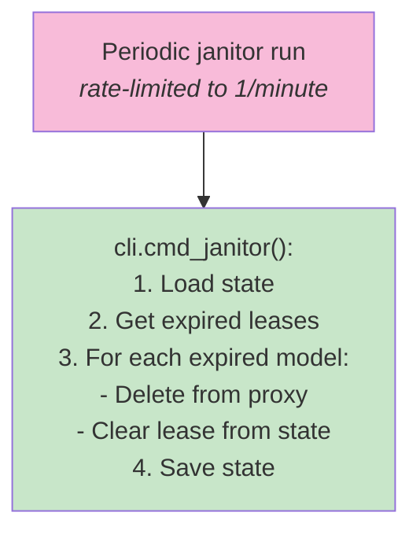
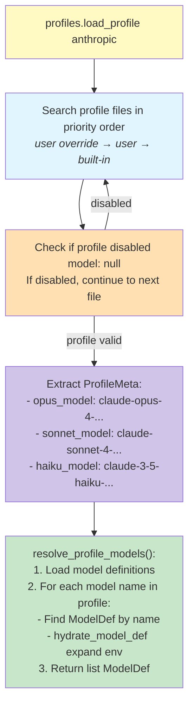
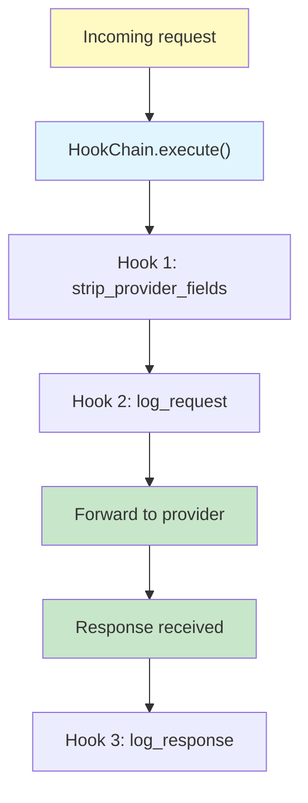

# Data Flows

Detailed request/response flows through the run-claude system.

## Directory Enter Flow

## Directory Leave Flow

## Janitor Cleanup Flow

## Profile Resolution Flow

## Hook Execution Flow

