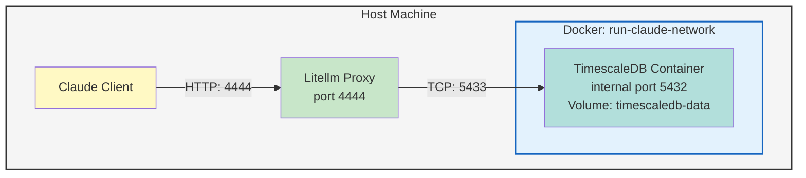

# Infrastructure

Network architecture, process lifecycle, database, and environment configuration.

## Network Architecture

## Proxy Configuration

| Setting | Default |
|---------|---------|
| Host | `127.0.0.1` |
| Port | `4444` |
| Master Key | Auto-generated (in `~/.config/run-claude/.secrets`) |
| Database | `postgresql://localhost:5433/postgres` |

## Proxy Startup

1. Generate `litellm_config.yaml` with model definitions
2. Spawn `litellm --config <path>` subprocess
3. Wait for health check (30 retries x 10s)
4. Store PID in `~/.local/state/run-claude/proxy.pid`
5. Update state with `proxy_pid`

## Proxy Shutdown

1. Read PID from file
2. Send SIGTERM
3. Wait for graceful exit (timeout: 5s)
4. Send SIGKILL if needed
5. Clean up PID file
6. Update state

## Database

TimescaleDB with extensions:

- **vector**: Vector embeddings for LLM context
- **pg_trgm**: Trigram search for text matching

LiteLLM uses Prisma ORM for model registry, API key management, and request/response logging.

Database management via `run-claude db`:

| Subcommand | Purpose |
|------------|---------|
| `start` | Start database container |
| `stop` | Stop container (--remove for volumes) |
| `status` | Container status |
| `migrate` | Run prisma migrate with LiteLLM config |

## Environment Variables

### Proxy Configuration

| Variable | Default | Purpose |
|----------|---------|---------|
| `LITELLM_PROXY_URL` | `http://127.0.0.1:4444` | Proxy base URL |
| `LITELLM_MASTER_KEY` | Auto-generated | Proxy API key |
| `LITELLM_DATABASE_URL` | See below | Database connection |
| `STORE_MODEL_IN_DB` | `True` | Enable DB model storage |
| `USE_PRISMA_MIGRATE` | `True` | Enable migrations |

### Client Environment (exported by `run-claude env`)

| Variable | Purpose |
|----------|---------|
| `ANTHROPIC_AUTH_TOKEN` | Proxy master key |
| `ANTHROPIC_BASE_URL` | Proxy URL |
| `ANTHROPIC_DEFAULT_OPUS_MODEL` | Profile's opus model |
| `ANTHROPIC_DEFAULT_SONNET_MODEL` | Profile's sonnet model |
| `ANTHROPIC_DEFAULT_HAIKU_MODEL` | Profile's haiku model |
| `API_TIMEOUT_MS` | API timeout (3000000ms) |

## Security Considerations

- Secrets file uses mode `0600` (owner only)
- API keys stored in `~/.config/run-claude/.secrets`
- Environment variables hydrated at runtime (not stored in configs)
- Proxy runs on localhost only (`127.0.0.1`)
- Database on non-standard port (`5433`) to avoid conflicts
